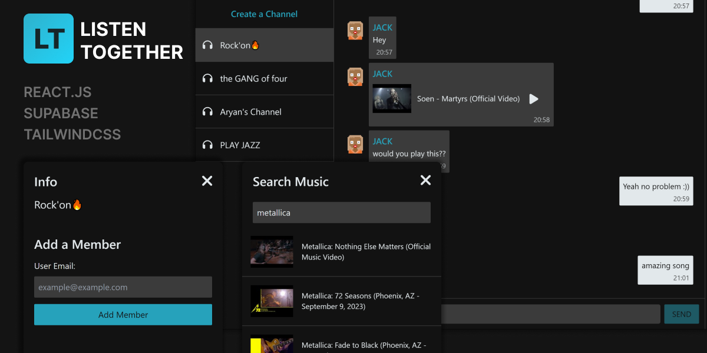
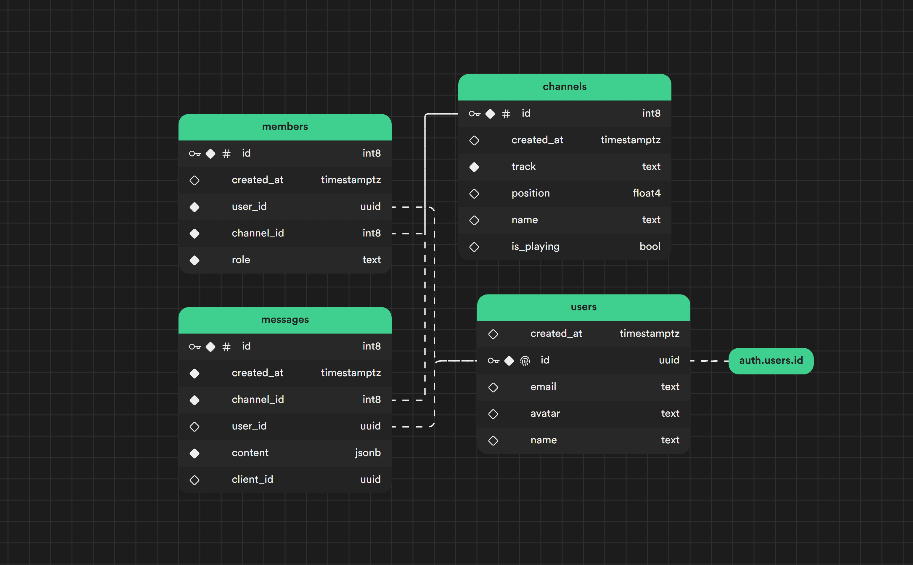

<p align="center" style="margin-top: 120px">
  <a href="https://listen-together-aryan.netlify.app">
   
  </a>
</p>

  <p align="center">
  A real-time chat app that allows you to listen to music synchronously with your friends.
  <br>
    <a href="https://listen-together-aryan.netlify.app"><strong>Demo</strong></a>
  </p>



## 💾 Database Schema

### Database schema: [here](./schema.sql)



## 📚 Tech Stacks

- React.js
- PostgeSQL managed by [Supabase](https://supabase.io/)
- Styled using [Tailwind CSS](https://tailwindcss.com/)
- Data Fetching, Infinite Scroll [React Query](https://tanstack.com/query/v3/)
- Context API + Reducer hook
- Bundle analyzer using webpack bundle analyzer

# ⚙️ Getting Started

## Requirements

To run this app locally you need

- [Node.js (Version: >=18.x)](https://nodejs.org/en/download/)
- Node Package Manager NPM - included in Node.js
- [PostgreSQL (local or remote)](https://www.postgresql.org/download/)

## Developer Quickstart

Want to get up and running quickly? Follow these steps:

- [Clone the repository](https://help.github.com/articles/cloning-a-repository/) to your local device.

  ```sh
  git clone https://github.com/aryan-mehrabi/listen-together
  ```

- Set up your [Supabase Database](https://supabase.com/docs/guides/database) and Auth with [Social Logins](https://supabase.com/docs/guides/auth/social-login)
- Set up your `.env` file using the recommendations in the `.env.example` file.
- Run `npm install` in the root directory
  ```sh
  npm install
  ```
- Run `npm start` in the root directory

That's it! You should now be able to access the app at http://localhost:3000

## 🙇 Author

- [Aryan](https://www.linkedin.com/in/aryan-mehrabi/)

## License

Licensed under the [MIT license](https://github.com/shadcn/taxonomy/blob/main/LICENSE.md).
